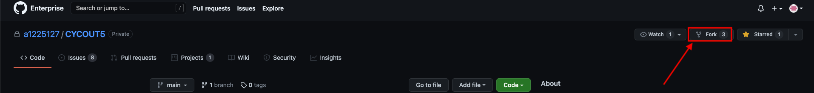
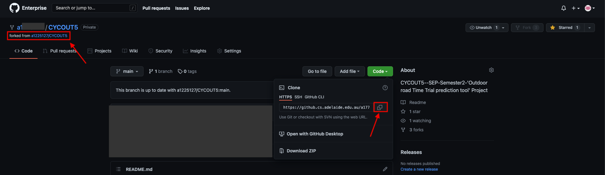
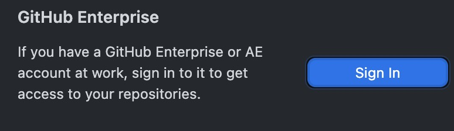
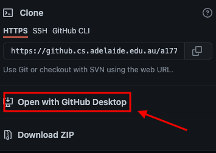
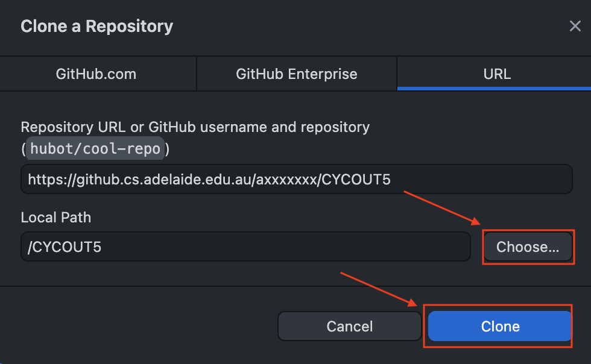
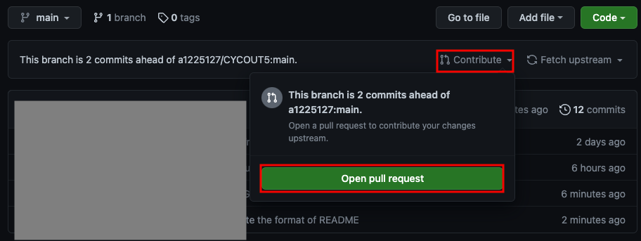

# Hi CYCOUT5, Read the following note, before you do the work

> Since we are aiming to practice the real GitHub workflow, please follow the following instruction to contribute your work in CYCOUT5 repository.

1. Go to our [original repository](https://github.cs.adelaide.edu.au/a1225127/CYCOUT5), click `Fork` to copy the original repository to your account. 

   

2. Then you will be automatically bring to the Forked repository (forked from `a1225127/CYCOUT5` shown on the top-left). 

   Copy the https link for the forked repository (https://github.cs.adelaide.edu.au/axxxxxxx/CYCOUT5.git).

   

3. Clone it locally.

   * Via terminal

     `git clone https://github.cs.adelaide.edu.au/axxxxxxx/CYCOUT5.git`

     

   * Via GitHub Desktop

     * Sign in your Github Enterprise account (university account) on GitHub Desktop. (notes: Enterprise address -> https://github.cs.adelaide.edu.au/)
     
         

     *  Instead of using https address, just click `Open with GitHub Desktop`
     
         

     * A pop up window will be shown, you can set the address you want to store the project. After that, click `clone`.

         

4. If you already have your normal GitHub account on your computer, and you don't want to commit the work via your normal account, you can fix the issues by change the local git config file or just use the GitHub Desktop and follow the graphic instructions.

5. So, you can start contributing now, after you changed the code and pushed it to your forked repository, open the forked repository on the website and `Open pull request`.

   

6. Then one of our member will do the review and merge it to the original repository.

